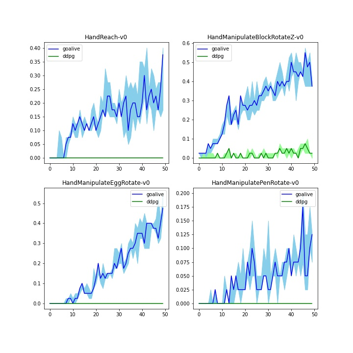

# How Does Goal Relabeling Improve Sample Efficiency?

**Repository:** This repository hosts the code and experiments for the GOALIVE algorithm described in the paper _“How Does Goal Relabeling Improve Sample Efficiency?”_. The site summarizes the key ideas and links to the full paper and related resources.

## Abstract

Goal relabeling and hindsight experience replay allow reinforcement learning (RL) agents to learn from failure by turning unsuccessful trajectories into useful training data. While widely used, there has been little theory explaining why these techniques improve sample efficiency. This paper constructs examples showing that using goal‑conditioned value functions can dramatically reduce sample complexity compared with single‑goal methods:contentReference[oaicite:0]{index=0}. Building on this insight, the authors propose **GOALIVE**, a model‑free algorithm that re‑evaluates Bellman errors under multiple relabeled goals to eliminate incorrect value functions. They also introduce the **goal‑conditioned Bellman–Eluder (GOAL‑BE) dimension** as a complexity measure to bound the sample complexity.

## Key contributions

- **Provable efficiency gains:** The authors prove that there exist MDPs for which model‑free algorithms with goal‑conditioned value functions achieve polynomial sample complexity, while algorithms without goal relabeling incur sample complexity exponential in the horizon.
- **Algorithmic innovation:** GOALIVE uses optimism‑led iterative value‑function elimination. It relabels trajectories with multiple goals and evaluates several Bellman errors for the same state–action pair, allowing it to eliminate more incorrect hypotheses.
- **New complexity measure:** The GOAL‑BE dimension provides a tighter upper bound on the number of samples needed and can be exponentially smaller than the classic Bellman–Eluder dimension.

## Results

The code accompanying the paper compares GOALIVE against baselines such as Deep Deterministic Policy Gradient (DDPG) on dexterous manipulation tasks. GOALIVE consistently achieves higher success rates.

## Resources

- [Paper (PDF)](https://raw.githubusercontent.com/mlresearch/v235/main/assets/zheng24a/zheng24a.pdf)
- [Code repository](https://github.com/SiruiZheng/GOALIVE)
- [Proceedings page](https://proceedings.mlr.press/v235/zheng24a.html)
